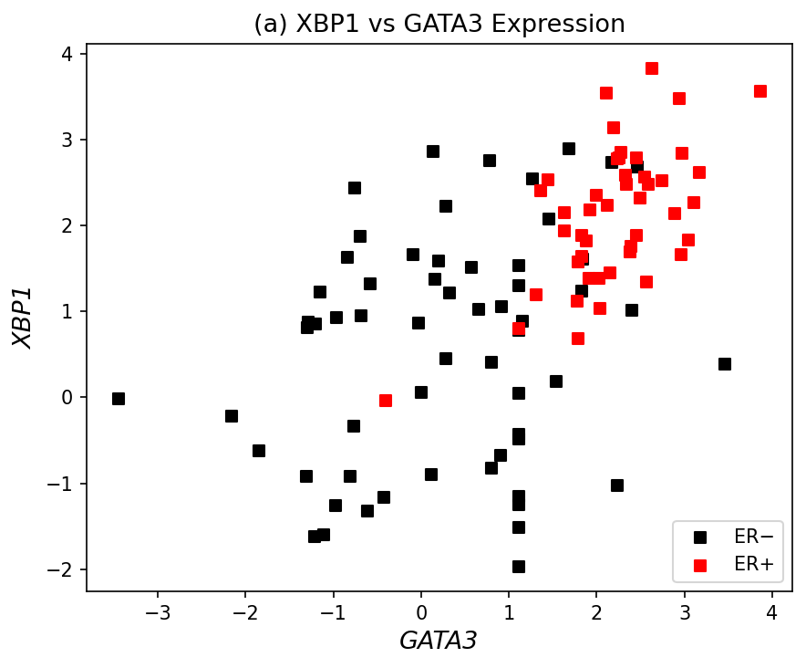
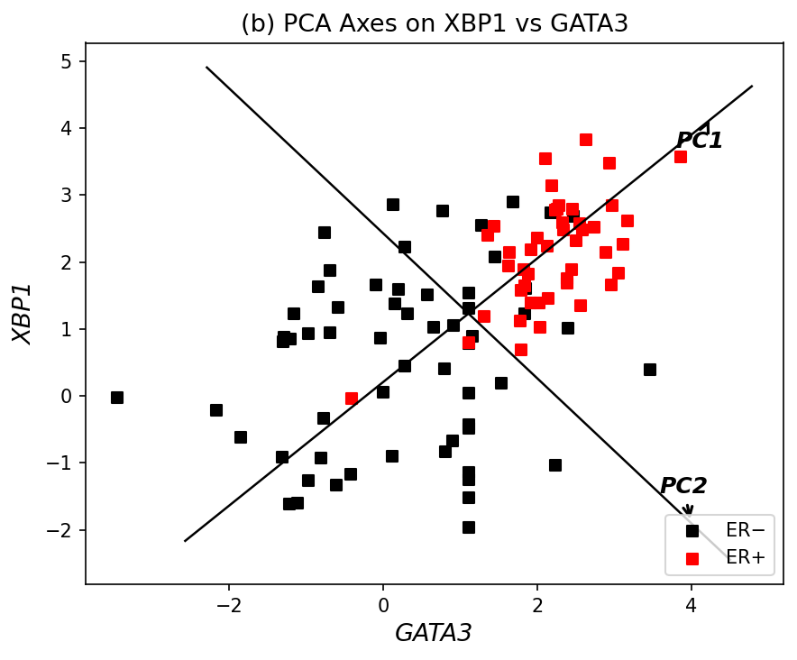
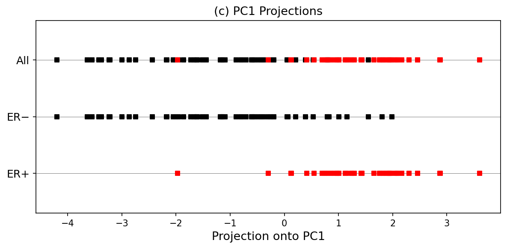
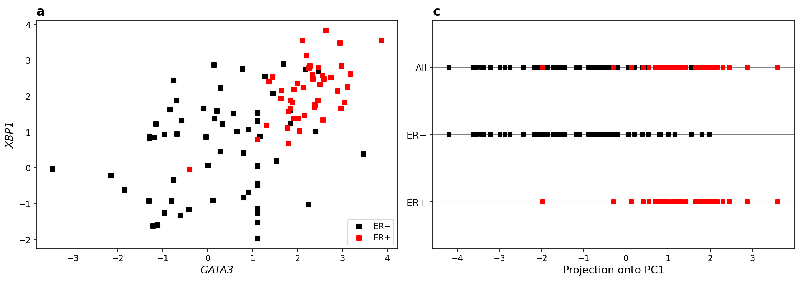

# PCA on Gene Expression Data — Breast Cancer (GSE5325)

## What We're Doing

We have gene expression data from 105 breast cancer patients. Each patient is labeled as either ER+ (estrogen receptor positive, label=1) or ER- (estrogen receptor negative, label=0). The dataset comes from GEO accession GSE5325 and was used in a Nature Primer on PCA.

The goal here is pretty straightforward:
1. Extract expression levels of two specific genes — **XBP1** and **GATA3** — for all 105 patients, then plot them as a scatter plot colored by class (Figure 1a).
2. Run PCA on this 2D data and project the points onto PC1 to see if PCA can separate ER+ from ER- (Figure 1c).

Basically we're reproducing Figure 1 from the paper.

---

## Data Overview

We have three data files:

- `data/class.tsv` — one label per line, 105 lines. `1` means ER+, `0` means ER-.
- `data/filtered.tsv.gz` — the expression matrix. 105 rows (patients) × 16174 columns (gene IDs). Each column header is a numeric gene ID.
- `data/columns.tsv.gz` — maps those numeric IDs to actual gene names and other metadata.

First we need to figure out which column IDs correspond to XBP1 and GATA3. From the column mapping file:
- **XBP1** → ID `4404`
- **GATA3** → ID `4359`

The README tells us that 4404 is XBP1, and when we search the columns file for GATA3, we find it at ID 4359.

---

## Step-by-Step Walkthrough

### Step 1: Load Everything

First we load the expression matrix, class labels, and column mapping.

```python
# load the expression matrix
df = pd.read_csv('data/filtered.tsv.gz', sep='\t', compression='gzip')
df.columns = df.columns.str.strip()

# load class labels
labels = pd.read_csv('data/class.tsv', header=None, names=['class'])
labels = labels['class'].values

# load column mapping
cols = pd.read_csv('data/columns.tsv.gz', sep='\t', compression='gzip', comment='#')
```

The expression matrix ends up being shape `(105, 16174)` — 105 patients and 16174 genes. We have 45 ER+ and 60 ER- patients.

### Step 2: Extract XBP1 and GATA3

Now we pull out the two columns we care about:

```python
xbp1_id = '4404'
gata3_id = '4359'

xbp1_expr = df[xbp1_id].values
gata3_expr = df[gata3_id].values
```

XBP1 values range from about -1.97 to 3.83, and GATA3 goes from -3.45 to 3.86. These are log-ratio expression values so negative means lower expression relative to reference.

### Step 3: Generate Figure 1a — XBP1 vs GATA3 Scatter Plot

Here we just plot GATA3 on x-axis and XBP1 on y-axis, color-coded by class:
- Black squares = ER- (label 0)
- Red squares = ER+ (label 1)

```python
er_pos = labels == 1
er_neg = labels == 0

ax.scatter(gata3_expr[er_neg], xbp1_expr[er_neg], c='black', s=30, marker='s', label='ER−')
ax.scatter(gata3_expr[er_pos], xbp1_expr[er_pos], c='red', s=30, marker='s', label='ER+')
```

The result clearly shows that ER+ patients tend to cluster in the upper-right region (high GATA3, high XBP1), while ER- patients are more spread out toward the lower-left. There's some overlap in the middle, but the trend is pretty clear — these two genes do a decent job of separating the classes visually.

### Step 4: Run PCA on the 2D Matrix

Now we take just these two gene columns, stack them into a 2D matrix, and run PCA.

```python
# build the 2D data matrix
X = np.column_stack([gata3_expr, xbp1_expr])  # shape: (105, 2)

# center the data
X_mean = X.mean(axis=0)
X_centered = X - X_mean

# covariance matrix
cov_matrix = np.cov(X_centered, rowvar=False)
```

The covariance matrix comes out as:
```
[[2.059  1.097]
 [1.097  1.884]]
```

The off-diagonal values (1.097) are positive, which makes sense — GATA3 and XBP1 are positively correlated (when one is high, the other tends to be high too).

Then we do eigendecomposition:

```python
eigenvalues, eigenvectors = np.linalg.eigh(cov_matrix)

# sort descending
idx = np.argsort(eigenvalues)[::-1]
eigenvalues = eigenvalues[idx]
eigenvectors = eigenvectors[:, idx]
```

Results:
- **Eigenvalues**: [3.072, 0.871]
- **PC1 direction**: [-0.735, -0.678] (roughly equal mix of both genes)
- **PC2 direction**: [0.678, -0.735] (perpendicular to PC1)
- **Variance explained**: PC1 = 77.9%, PC2 = 22.1%

So PC1 captures about 78% of the total variance. That's a lot — it means most of the spread in this 2D space is along one direction, which is the diagonal where both GATA3 and XBP1 increase together.

### Step 4b: Visualize the PCA Axes — Figure 1b

Before projecting, it helps to actually see where these PC axes sit on the original scatter plot. So we take the same GATA3 vs XBP1 plot and draw the PC1 and PC2 directions as lines through the data center (the mean point).

```python
# draw PC1 and PC2 lines through the mean
for i, pc_label in enumerate(['PC1', 'PC2']):
    direction = eigenvectors[:, i]
    start = X_mean - line_len * direction
    end = X_mean + line_len * direction
    ax.plot([start[0], end[0]], [start[1], end[1]], 'k-', linewidth=1.2)
```

PC1 runs diagonally from the lower-left to the upper-right — basically along the direction where both genes increase together. PC2 is perpendicular to it. This makes sense visually: the data is stretched more along that diagonal, so that's where the maximum variance is.

### Step 5: Project onto PC1 — Figure 1c

Now we project each patient onto PC1:

```python
pc1_projections = X_centered @ eigenvectors[:, 0]
```

This gives us a single number per patient — their position along the PC1 axis. We flip the sign so ER+ ends up on the right side (the sign of an eigenvector is arbitrary, so this is just to match the reference figure's convention).

Then we plot these projections as a 1D strip chart with three rows:
- **All**: both classes together
- **ER-**: only the ER- patients (black)
- **ER+**: only the ER+ patients (red)

The separation is visible. ER- patients mostly cluster on the left (negative PC1 values), and ER+ patients cluster on the right (positive PC1 values). There's overlap, but the trend is clear — PCA on just two genes already gives us a decent separation of the two cancer subtypes.

---

## Results

### Figure 1a — XBP1 vs GATA3 Expression



ER+ patients (red) cluster in the upper-right corner, showing high expression of both XBP1 and GATA3. ER- patients (black) are more scattered toward the lower-left. The correlation between the two genes is clearly visible.

### Figure 1b — PCA Axes on the Scatter Plot



Here we overlay the PC1 and PC2 axes on the same scatter plot. PC1 is the tilted line running from lower-left to upper-right — this is the direction of maximum variance in the data. PC2 is perpendicular to it. You can see that PC1 basically follows the diagonal trend of the data, which is why projecting onto it preserves most of the information (77.9% of variance). The data spreads much more along PC1 than along PC2.

### Figure 1c — PC1 Projections



When we project onto PC1, we get a 1D separation. ER- patients tend to have negative projections, ER+ patients tend to have positive projections. The "All" row shows both mixed together — you can see the black points on the left and red on the right with some overlap in the middle.

### Combined View



---

## Key Observations

1. **GATA3 and XBP1 are correlated** — the covariance matrix shows a positive off-diagonal value of 1.097. Both genes tend to be highly expressed in ER+ patients and lower in ER-.

2. **PC1 captures 77.9% of variance** — since both genes move together (they're correlated), most of the variance is along the diagonal direction. PC1 basically captures the "overall expression level" of both genes simultaneously.

3. **PC1 separates the classes** — even with just 2 genes, projecting onto PC1 gives us a reasonable separation between ER+ and ER-. This is the whole point of the paper's Figure 1 — PCA can find directions that naturally align with biologically meaningful classes.

4. **The PC1 direction** is roughly equal parts GATA3 and XBP1 (weights of ~0.73 and ~0.68). So it's not dominated by either gene — it's a balanced combination of both.

5. **The separation isn't perfect** — there's overlap, which is expected. Cancer subtypes are complex and two genes alone can't perfectly classify all patients. But the trend is strong enough to be clinically useful.

---

## How to Run

```bash
pip install numpy pandas matplotlib
python pca_analysis.py
```

This generates four output images: `figure_1a.png`, `figure_1b.png`, `figure_1c.png`, and `figure_1a_1c_combined.png`.
